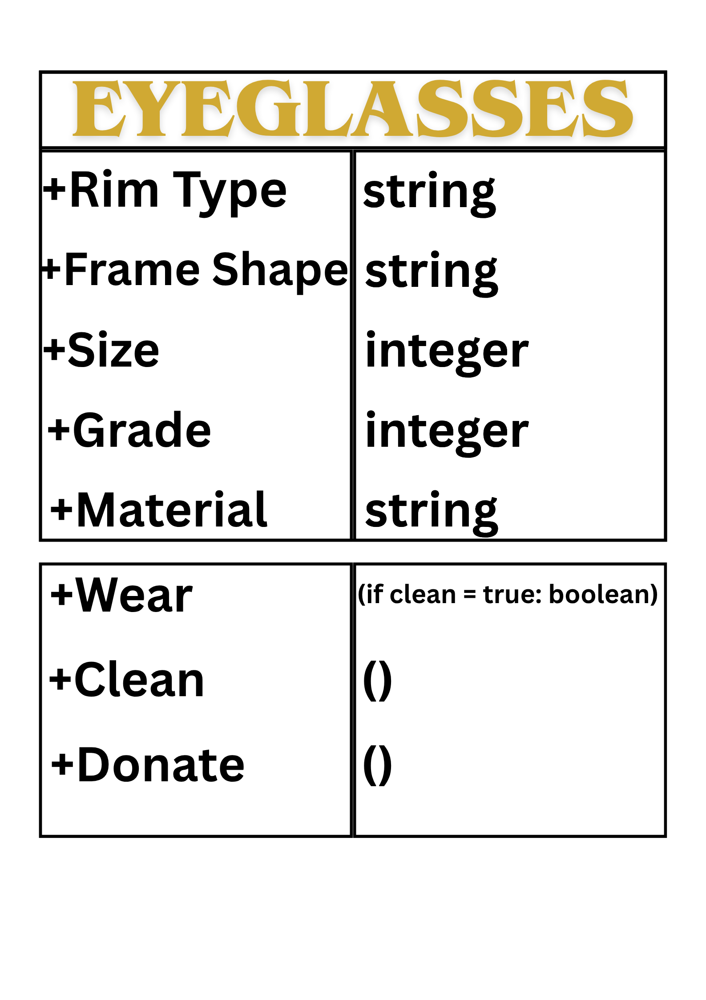
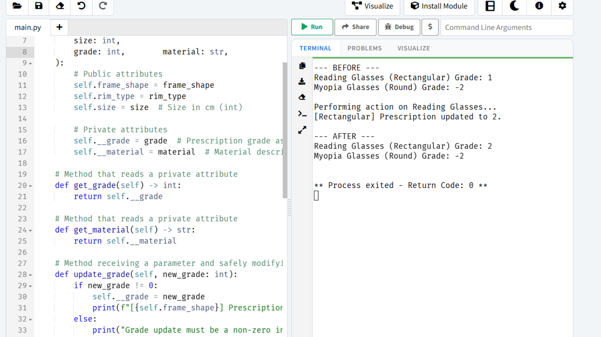
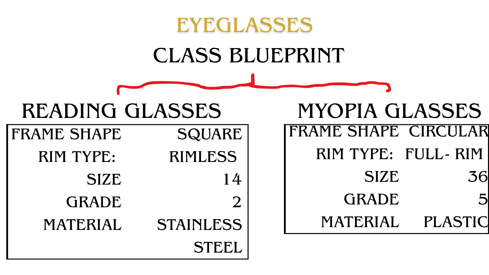

# Class Attributes and Methods
## Previous Activity
Link to my previous activity:
[q1/classObjectUML.md](q1/classObjectUML.md)

## Design Revision
- No major changes were made to my original design

## Visibility Decisions
| Attribute | Data Type | Visibility | Reason |
|---|---|---|---|
| Rim Type | string | Public | The Eyeglasses' Rim Type (e.g Full Rim, Half Rim, Semi Rimless, Rimless) |
| Frame Shape | string | Public | The Eyeglasses Frame Shape (e.g Round, Oval, Rectamgular, Cateye, Aviators) |
| Size | int | Public | The Lens and Bridge width, and Temple Length of the Eyeglasses |
| Grade | int | Private | The "Grade" of the Eyeglasses Lens |
| Material | String | Private | Type of Material used for the Eyeglasses Frame |

## Updated UML Class Diagram

## Python Implementation
[classImplementation.py](classImplementation.py)

## Test Run

## Object Diagram

## Analysis

## Why did you make your chosen attributes private?
Grade and Material are private to enforce encapsulation, and data privacy or protection.

## Which method changes the state of your object?
"Update Grade" and "Change Material"

## How did your two objects demonstrate that instances are independent?
The two instances, reading_glasses and myopia_glasses, demonstrated independence during the grade update action:
When reading_glasses.update_grade(2) was executed, only reading_glasses had its grade updated from 1 to 2.
The myopia_glasses instance remained completely unchanged with a grade of

## What is the difference between your class diagram and your object diagram?
Class diagram: The blueprint showing the general structure (attributes and methods) without any actual data.
Object diagram: A snapshot showing real instances holding specific values at a single point in time.
