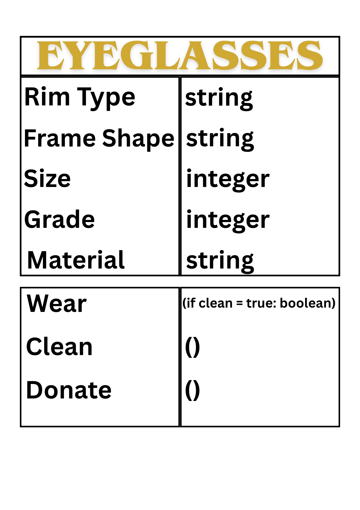

# Class Attributes and Methods
## Previous Activity
Link to my previous activity:
maya na po sir

## Design Revision
- No Major Changes were made to my Original Design

## Visibility Decisions
| Attribute | Data Type | Visibility | Reason |
|---|---|---|---|
| Rim Type | string | Public | The Eyeglasses' Rim Type (e.g Full Rim, Half Rim, Semi Rimless, Rimless) |
| Frame Shape | string | Public | The Eyeglasses Frame Shape (e.g Round, Oval, Rectamgular, Cateye, Aviators) |
| Size | int | Public | The Lens and Bridge width, and Temple Length of the Eyeglasses |
| Grade | int | Private | The "Grade" of the Eyeglasses Lens |
| Material | String | Private | Type of Material used for the Eyeglasses Frame |

## Updated UML Class Diagram

## Python Implementation

## Test Run

## Object Diagram

## Analysis
