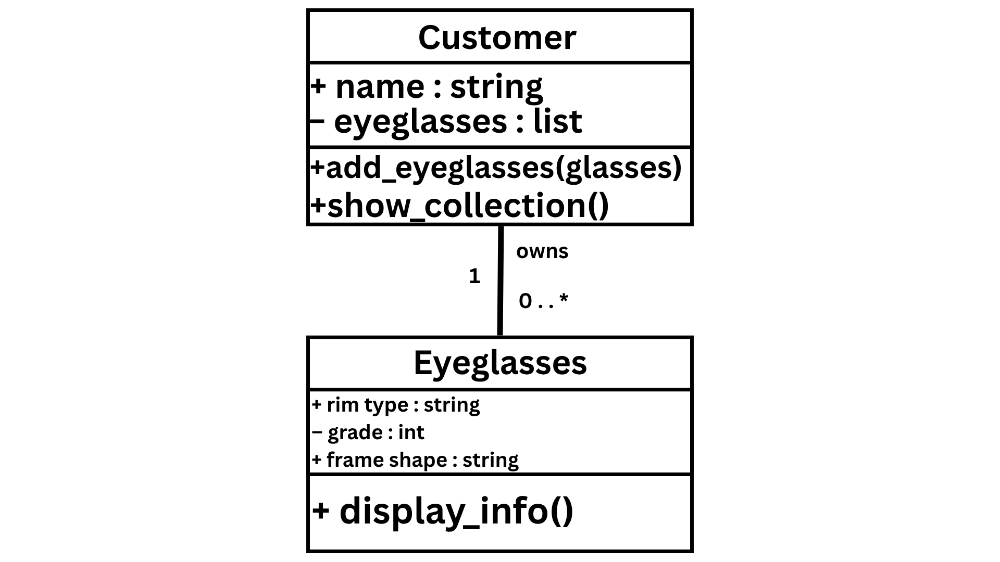
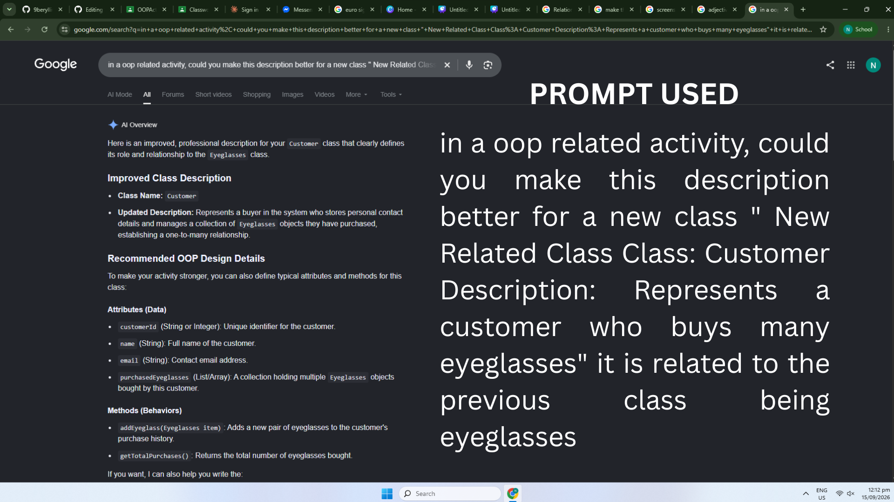
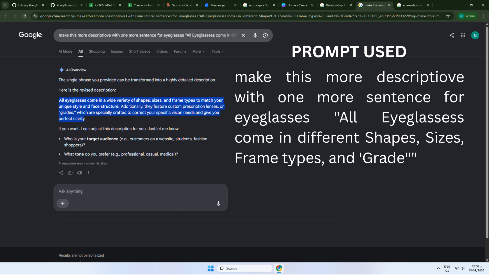
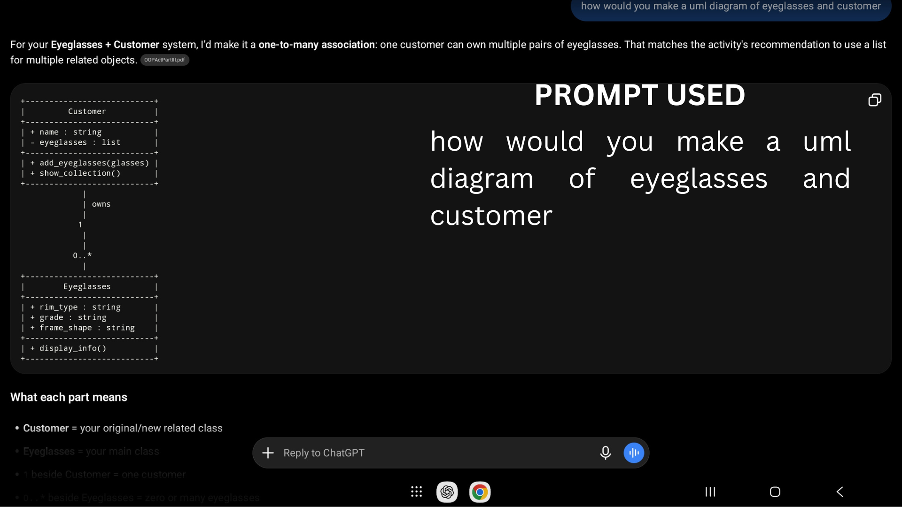

# Class Relationships: Association and Multiplicity
## Previous Activities
Link to my previous activities:

[Part I - Classes and Objects](classObjectUML.md)

[Part II - Class Attributes and Methods](classImplementation.md)

## Existing Class
Class: Eyeglasses

Description: All eyeglasses come in a wide variety of shapes, sizes, and frame types to match your style and face. Additionally, they feature custom prescription lenses, which are numerically sorted trough "grades," these lens are specially crafted to correct your specific vision needs and give you perfect clarity.

## New Related Class
Class: Customer

Description: Represents a Customer or Buyer in the system who stores their personal details, (e.g., grade, preferred rim type and more) and owns one or more Eyeglasses, these are objects they have purchased, establishing a certain type of relationship.

## Association
Relationship: Customer HAS-A Eyeglasses

Action Phrase: "owns" 

## Multiplicity
Multiplicity: 1 : 0 (One To Many)

Explanation: A customer can own zero or many pairs of eyeglasses, while each eyeglasses object belongs to one customer. This lets us store multiple object references in a Python List. (rewrite)

## UML Class Relationship Diagram

## Python Implementation
[View Python Source](classRelationships.py)

## Test Run

## Object Relationship Diagram
![Object Relationship Diagram](link sa image folder

## Analysis
### What is the association between your two classes?

### What multiplicity did you choose and why?

### How did you implement the relationship in Python?

### Why did you store an object reference instead of copying its data?

### If your relationship uses many, why is a list appropriate?

### LLM Prompt Used AND Proof

